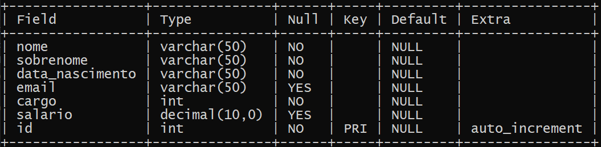
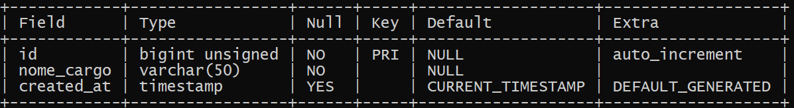

 # Sistema Funcionários 

## Índice

* [1. Sobre o projeto](#1-sobre-o-projeto)
* [2. Funcionalidades da aplicação](#2-funcionalidades-da-aplicação)
* [3. Uso](#3-uso)
* [4. Visualização](#4-Visualização)
* [5. Ferramentas Utilizadas](#5-ferramentas-utilizadas)

***

## 1. Sobre o projeto
Aplicação desenvolvida para controle e consulta de funcionários.
Para isso foi criado um banco de dados no MySQL e interface JAVA.

## 2. Funcionalidades da aplicação
As funcionalidades disponibilizadas ao usuário são:

* Cadastro de Cargo;
* Consulta, edição e exclusão de cargos;
* Cadastro de Funcionários;
* Consulta, edição e exclusão de funcionários;
* Apresentaçáo de relatórios de cargos e salários.

Ao desenvolver cada funcionalidade, foram desenvolvidos critérios que deveriam ser cumpridos para atender a _definição de pronto_.

## 3. Uso
Para visualização dessa aplicação, você deverá ter instalado o JVM e criar o seu próprio banco de dados.

Para conectar o seu Banco de Dados com o projeto, você deverá alterar o arquivo *BancoDeDados.java*, que se encontra na pasta src/sistema/BancoDeDados, e inserir sua *stringDeConexão*, *usuário* e *senha*.

### Banco de Dados

O banco de dados deverá ter o nome de *sistema_de_funcionarios*

A tabela FUNCIONÁRIOS deverá se chamar *funcionarios* e deverá ser criada com as definições do exemplo abaixo.

A tabela CARGOS deverá se chamar *cargos* e deverá ser criada com as definições do exemplo abaixo.

## 4. Visualização

Aqui você pode visualizar como o projeto funciona.

## 5. Ferramentas utilizadas

Para desenvolver essa aplicação, utilizamos as seguintes ferramentas:

* JAVA
* MySQL
* Eclipse
* GIT
* GitHub
